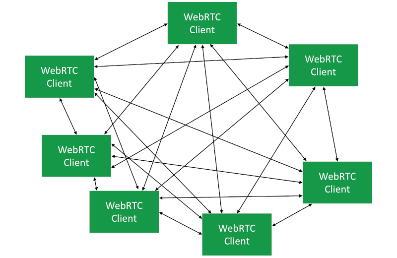
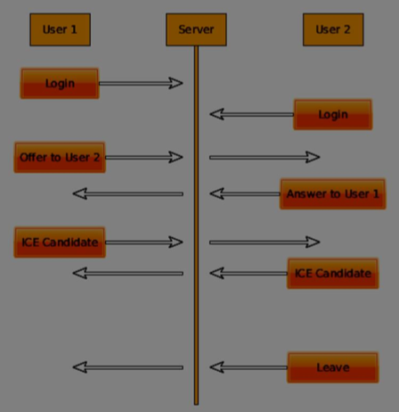
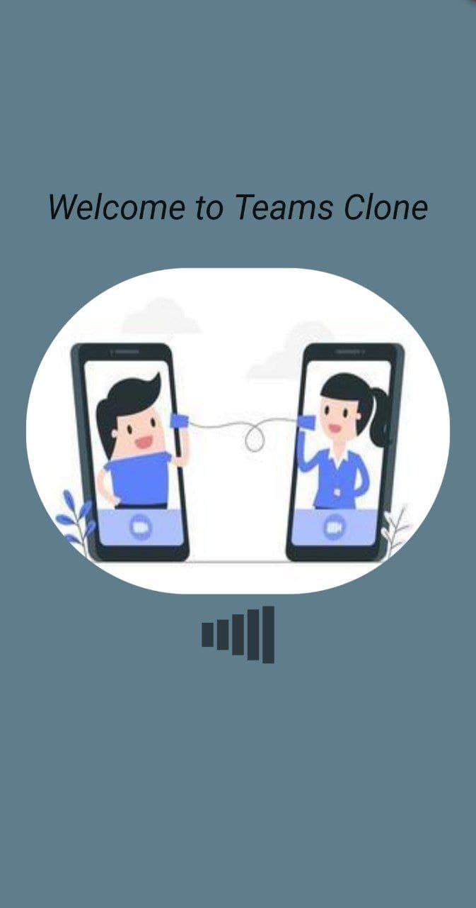
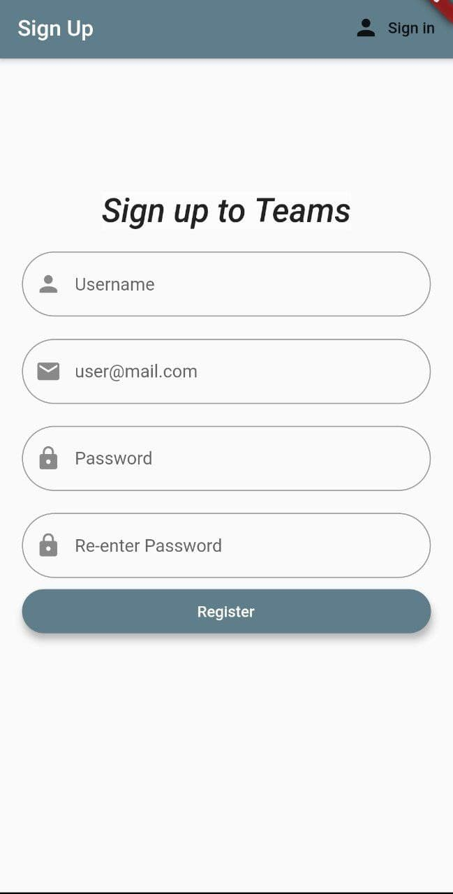
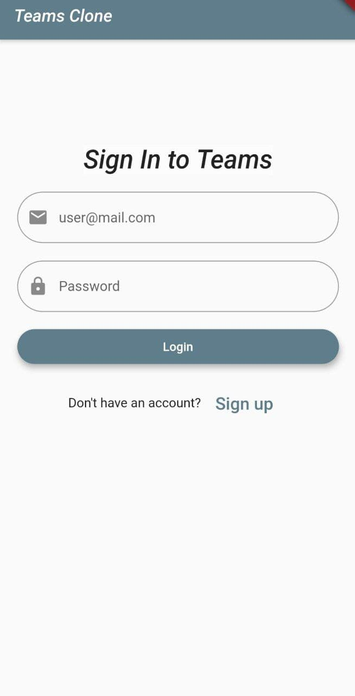
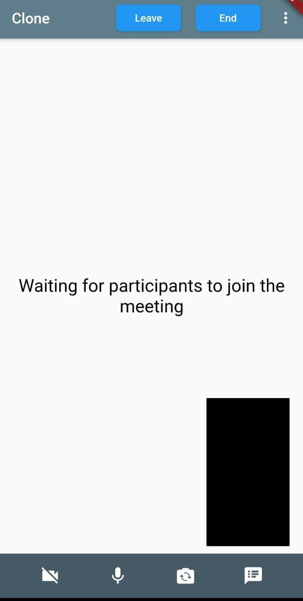

# A Clone of Microsoft Teams

This is a Flutter project which uses Firebase for authentication and WebRTC for Video Conferencing.

<!-- PROJECT LOGO -->
<br/>
<p align="center">
   

   <h3 align="center">Microsoft Engage 2021 Challenge</h3>
   <p align ="center">
   <br/>
   <!-- Youtube Video Link -->
   <a href=" ">View Demo</a>
   .
   <a href=" ">Live Site</a>
   </p>
   </p>


   <!-- TABLE OF CONTENT -->
   <details open="open">
   <summary>Table of Contents</summary>
   <ol>
    <li>
     <a href="#about-the-project">About The Project</a>
     <ul>
      <li><a href="#development-methodology">Development Methodology</a></li>
       </ul>
      <ul>
        <li><a href="#built-with">Built With</a></li>
      </ul>
    </li>
    <li><a href="#architecture">Architecture</a>
    <li>
      <a href="#getting-started">Getting Started</a>
      <ul>
        <li><a href="#pre-requisites">Pre-requisites</a></li>
        <li><a href="#installation">Installation</a></li>
      </ul>
    </li>
    <li><a href="#snapshots">Snapshots</a></li>
    <li><a href="#scope">Scope</a></li>
    <li><a href="#contact">Contact</a></li>
    <li><a href="#acknowledgements">Acknowledgements</a></li>
  </ol>
</details>


<!-- ABOUT THE PROJECT -->
## **About the Project**
Engage 2021 is a Engagement and Mentorship program created by Microsoft engineers, in association with Ace Hacker team, for engineering students.Through this initiative, students get a chance to be mentored by Microsoft and be a part of AMA Sessions, Webinars and Leader talks delivered by Microsoft employees. The challange was to **build a Microsoft Teams Clone** . It should be a fully functional prototype with at least one mandatory functionality - *a minimum of two participants should be able connect with each other using your product to have a video conversation*.[Microsoft Engage 2021](https://microsoft.acehacker.com/engage2021/?mc_cid=51cf8705a5&mc_eid=e7a7568555#challenge)


### **Development Methodology :**

### Scrum Methodology

Scrum is an **Agile** development methodology used in the development of software based on an iterative and incremental processes. Each iteration consists of two to four week sprints, where each sprint’s goal is to build the most important features first and come out with a potentially deliverable product.

### **Sprint Map**
 Below points provides insight to sprint wise progress and bugs:

- #### **Week 1** : 
    1.  Learn about developement.
    2.  Decide tech stack and architecture.
    3.  Learn **Flutter**.
    4.  Learn about Git and GitHub.

- #### **Week 2** : 
    1.  Work on the User Interface.
    2.  Research about extra features.
    3.  Exploration about Firebase and WebRTC.
    4.  Complete Sign-in and Sign-up.
    5.  Authenticate email and password.
    #### *Bugs* : WebRTC implementation, Authentication.

- #### **Week 3** :
    1.  Add extra features like mute, camera off, switch camera.
    2.  Add chat feature during video call.
    3.  Implementation of WebRTC.
    4.  Exploration about Servers.
    5.  Run application on local server.
    6.  Update UI(Add splash screen, Add loading widgets).
    #### *Bugs* : Not working globally, bugs in server deployment.

- #### **Week 4** :  
    1.  Add app icon.
    2.  Server deployment on Heroku.
    3.  Global working(Testing on different networks).
    4.  Try to implement adapt feature.
    5.  Create apk file(App deployment).
    6.  Update README.
    7.  Create demo video.
    #### *Bugs* : Globally not working on some ISPs.


### **Built With**
* [Flutter](https://flutter.dev/docs/get-started/install)
* [Firebase](https://firebase.google.com/)
* [WebRTC](https://webrtc.org/)
* [Nodejs](https://nodejs.org/en/)

## **Architecture :**
Clone uses Peer to Peer mesh architecture. Mesh architecture provides group video call functionality. WebRTC is used for the real time media communication between devices. WebRTC is a fully peer-to-peer technology for the real-time exchange of audio, video, and data, with one central caveat. Making this into a group call in P2P translates into a mesh network, where every WebRTC client has a peer connection opened to all other clients directly. When dealing with WebRTC and indicating Peer to Peer mesh, the focus is almost always on media transport. The signaling still flows through servers as WebRTC doesn't provide signaling which is essential for establishing connection.
<p align="center">
   

First of all, each user registers with the server. Once users have registered, they are able to call each other. On creating a meet, a code is generated. User 1 makes an offer with all the users currently connected with this particular code. The other users should answer. Finally, ICE candidates are sent between users until they can make a connection.

To create a WebRTC connection clients have to be able to transfer messages without using a WebRTC peer connection. This is where we will use HTML5 WebSockets – a bidirectional socket connection between two endpoints – a web server and a client.


<p align="center">
   


<!-- GETTING STARTED -->
## **Getting Started**

### Pre-requisites
- [Basic setup of Flutter](https://flutter.dev/docs/get-started/install)
- [Basic setup of VSCode](https://code.visualstudio.com/download)
- [Server Setup](https://github.com/varsha842/Teams-Clone-Server.git)

### Installation

- Install the [app]().

**(OR)**

1. Setup the server as given [here](https://github.com/varsha842/Teams-Clone-Server.git).


2. Clone the repo
```sh
git clone https://github.com/varsha842/Teams-Clone.git
```
3. Install [Flutter](https://flutter.dev/docs/get-started/instal) on your device. Install the [Flutter Extension](https://marketplace.visualstudio.com/items?itemName=Dart-Code.flutter) on VSCode.

4. Connect your Android Device with USB debugging and Developer Mode activated.

5. If you wish to use the Local Server instead of the Global One(default), exchange the commented links with their next lines after inserting your appropriate local IP adress [here](https://github.com/varsha842/Teams-Clone/blob/2a1815a9aa1f7685687cd75e7a67c2bc015df56a/lib/services/meet_api.dart#L6), [here](https://github.com/varsha842/Teams-Clone/blob/2a1815a9aa1f7685687cd75e7a67c2bc015df56a/lib/sdk/meeting.dart#L12) and [here](https://github.com/varsha842/Teams-Clone/blob/2a1815a9aa1f7685687cd75e7a67c2bc015df56a/lib/screen/MeetScreen.dart#L231).

6. Run the [main.dart](https://github.com/varsha842/Teams-Clone/blob/main/lib/main.dart) file


## **Snapshots :**







<br/>

<!-- ROADMAP -->
## Scope
### Features
- Connectivity  for 4-5 participants
- Allow chat during video call.
- Invite by meeting ID.
- Sign-in and sign-up authentication.
- Camera switch.


### Possible Improvements
- Clone uses publically avalible free stun/turn servers, custom and dedicated stun/turn servers can be used to improve cross network connection capabilities.
- SFU/MCU implementation can be used to reduce dependency on download/upload speed of individual network connection.
- Share screen feature can be added.
- Share link feature can be added.

<!-- CONTACT -->
## Contact
- Gmail : varshajangir75@gmail.com
- Project : [https://github.com/varsha842/Teams-Clone](https://github.com/varsha842/Teams-Clone)

<!-- ACKNOWLEDGEMENTS -->
## Acknowledgements
- [nodemon](https://www.npmjs.com/package/nodemon)
- [sdp_transform](https://pub.dev/packages/sdp_transform)
- [uuid](https://pub.dev/packages/uuid)
- [eventify](https://pub.dev/packages/eventify)
- [flutter_spinkit](https://pub.dev/packages/flutter_spinkit)
- [delayed_widget](https://pub.dev/packages/delayed_widget)
